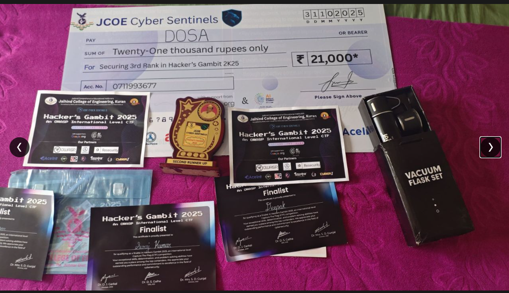
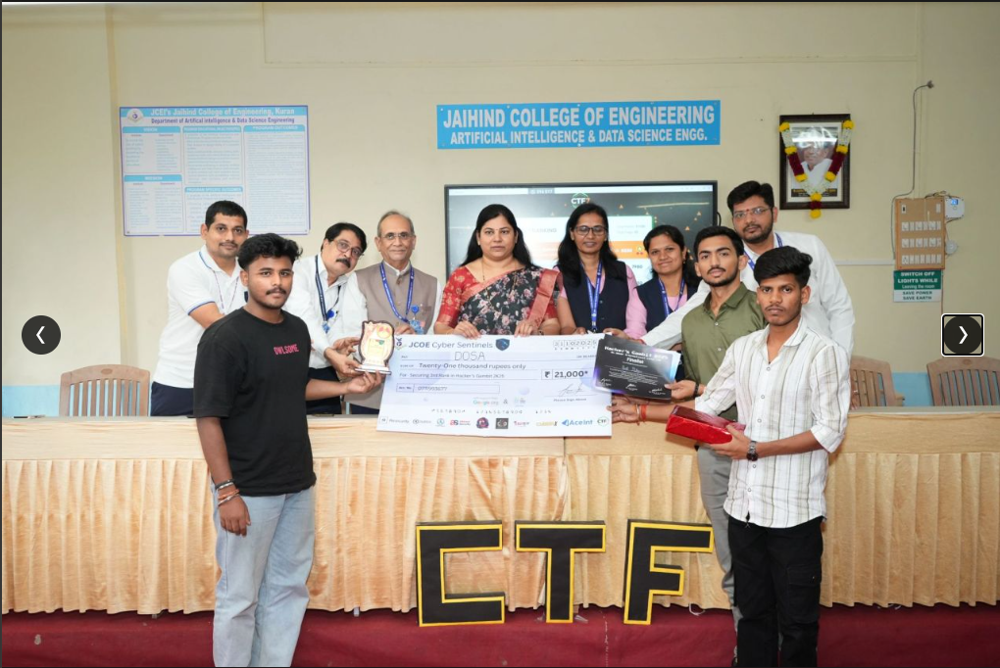
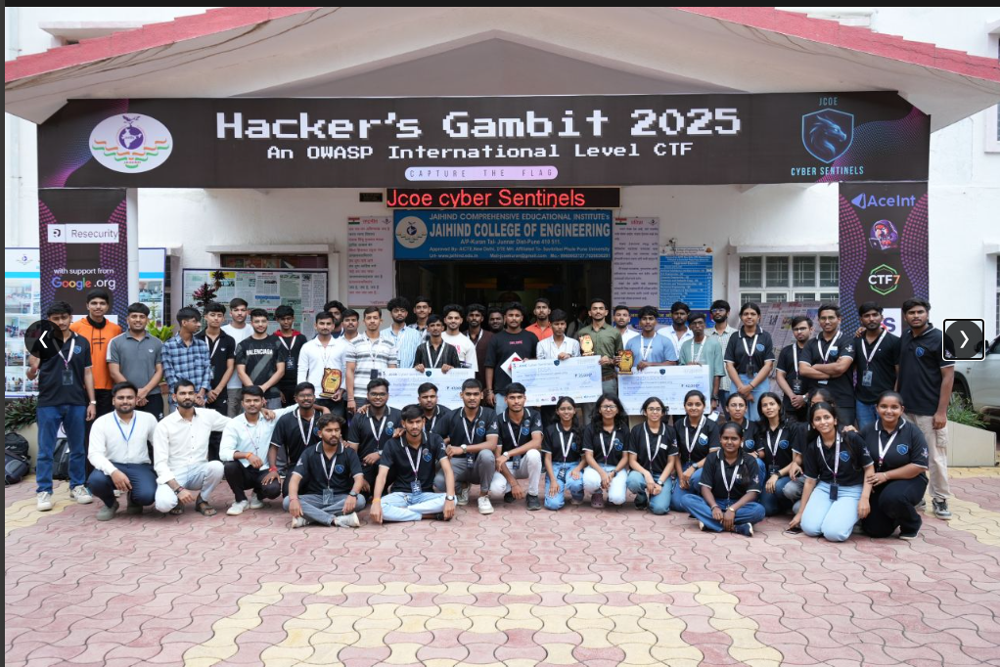
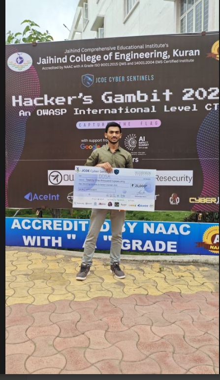

# Hacker's Gambit 2025 — OWASP International Level CTF

> **3rd Place (Second Runner Up)** | Prize: ₹21,000 | Team: DOSA  
> Organized by JCOE Cyber Sentinels, Jaihind College of Engineering, Kuran  
> Supported by Google.org · OWASP · Resecurity · AceInt · CTF7

---

## Result

| Event | Hacker's Gambit 2025 |
|-------|----------------------|
| Level | OWASP International CTF |
| Rank | 3rd Place — Second Runner Up |
| Prize | ₹21,000 |
| Team | DOSA |
| Date | 31 October 2025 |
| Venue | Jaihind College of Engineering, Kuran, Maharashtra |

---

## Proof

### Prize Cheque — ₹21,000

### Award Ceremony

### Event — Hacker's Gambit 2025

### Certificate & Trophy

---

## About the Event

Hacker's Gambit is an international-level CTF organized annually by JCOE Cyber Sentinels under the OWASP banner. The 2025 edition drew participants from colleges across India competing across multiple cybersecurity domains.

Domains covered in the competition included web exploitation, forensics, cryptography, binary exploitation, OSINT, cloud security, and mobile security.

---

## Note on Writeups

Detailed challenge writeups for this event were not documented at the time of competition. For my documented CTF writeups with full methodology, see:

- [CTF Writeups (LPU CyberWar 2026 + others)](https://github.com/parth0xu/Writeup)
- [HTB Machine Writeups](https://github.com/parth0xu/htb-writeups)

---

## Other CTF Results

| Event | Rank | Notes |
|-------|------|-------|
| TRYST CTF 2026 (IIT Delhi) | 2nd | 2550 pts |
| Cyber War 2026 (LPU × CompTIA × Quick Heal) | 2nd | ₹10,000 prize |
| **Hacker's Gambit 2025 (OWASP)** | **3rd** | **₹21,000 prize** |
| Bypass CTF 2025 (AIT Pune) | 4th | 44/51 flags, 86% completion |
| UNI6CTF 1.0 | 4th | 6815 points |
